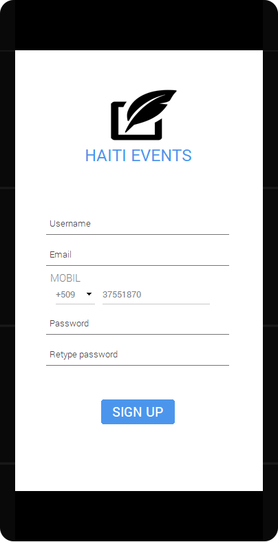
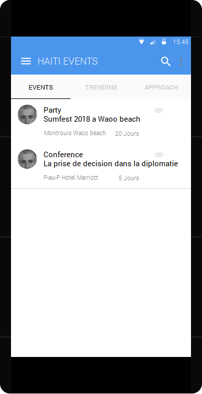
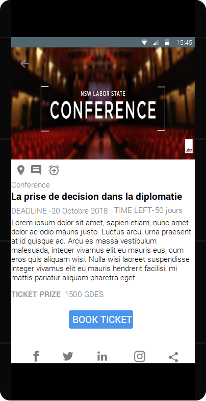
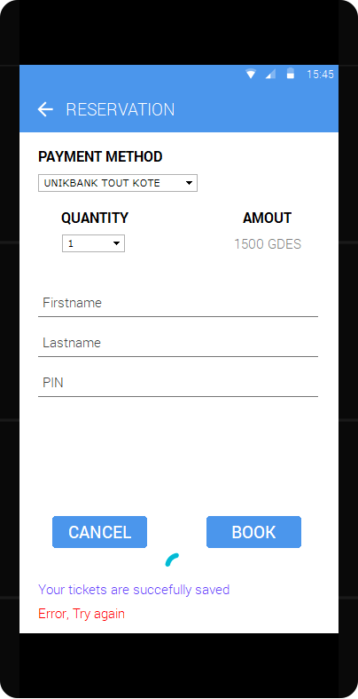

# EventsInHaiti | Group 2 Codepath St Louis 2018*

**Haiti Events** is an android app that aims to display different types of events whether cultural, social or intellectual. We offer users the opportunity to buy their ticket and reserve their place online buy using existing payment method such as MonCash or Debit Card

## User Stories
The following **required** functionality is completed:
* [ ] User should Sign up before using the app
* [ ] User can switch between Events, Trending and Approach views using tabs.
  * [ ] User can view All events.
  * [ ] User can view Trending events.
  * [ ] User can view Approach events.
* [ ] A Menu Bar where user can Have  a profil that will allow him to:
  * [ ] Change Image profil
  * [ ] Edit Username
  * [ ] Edit Email
  * [ ] Edit Number phone
  * [ ] Change Password
  * [ ] See and Choose a category of Events such as (Party, Conference, Concert, Workshop etc..)
* [ ] User can tap an Event to display a "detailed" view of that Event 
* [ ] User can **scroll down to see more Events**.
* [ ] User can search an Event

The following **optional** features are implemented:

* [ ] User can book Tickets using existing payment method
* [ ] An Archive wich User can see all tickets he book in the App
* [ ] User can **share an Event link** to their friends on social media such as (Facebook, Twitter, Instagram, Wahtsapp etc... ) or email it to themselves
* [ ] User can Locate an Event
* [ ] User can Comment an Event
* [ ] User can add an Event to his calendar via the app

Here's a walkthrough of implemented user Interfaces:
 

## License

You are granted a non-exclusive License to use the Software for any purposes for an unlimited period of time. The software product under this License is provided free of charge.
Even though a license fee is not paid for the use of Freeware Version software, it does not mean that there are no conditions for using such software:

    The Software may be installed and used by the Licensee for any legal purpose.
    The Software may be installed and used by the Licensee on any number of systems.
    The Software can be copied and distributed under the condition that original copyright notice and disclaimer of warranty will stay intact, and the Licensee will not charge money or fees for the Software product, except to cover distribution costs.
    The Licensee will not have any proprietary rights in and to the Software. The Licensee acknowledges and agrees that the Licensor retains all copyrights and other proprietary rights in and to the Software.
    Use within the scope of this License is free of charge and no royalty or licensing fees shall be paid by the Licensee.